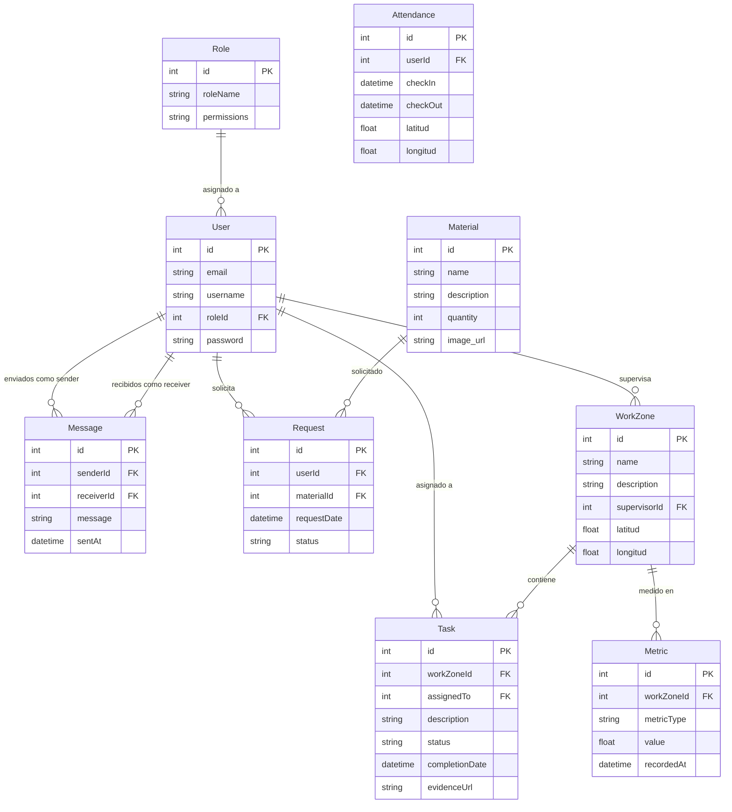
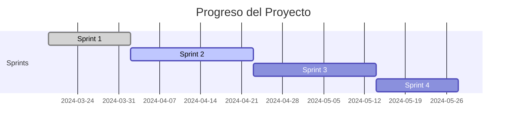

# 🏗️ Sistema de Gestión de Obras de Construcción


**Plataforma digital para optimizar la administración de obras, control de asistencia, gestión de materiales y cálculo de pagos.**  
*Desarrollado por estudiantes de la Universidad Tecnológica de Pereira para la materia TS683 Administracion Y Planeacion De Proyectos Software Gr. 401.*

---

## 🚀 Características Clave

| Módulo                  | Descripción                                                                 | Tecnologías Usadas                     |
|-------------------------|-----------------------------------------------------------------------------|----------------------------------------|
| 👥 **Gestión de Usuarios** | Registro de roles (supervisor, trabajador, administrador) con permisos.     | Node.js, JWT, PostgreSQL, React, bcrypt, prisma       |
| 📍 **Control de Asistencia** | Check-in/out con geolocalización y reportes en tiempo real.                 | Leaflet, React-Leaflet, Turf.js             |
| 🧱 **Gestión de Materiales** | Solicitud y aprobación de materiales con notificaciones instantáneas.       | Radix UI, Tailwind CSS |
| 💼 **Cálculo de Pagos**    | Automatización de horas trabajadas y generación de resúmenes descargables.  | PDFKit, Chart.js, Recharts, date-fns          |

---

## 📋 Requerimientos Funcionales (RF)

| **Código** | **Descripción**                                                                 | **Prioridad** | **Tiempo** |
|------------|---------------------------------------------------------------------------------|---------------|------------|
| **RF01**   | Gestión de usuarios y roles con autenticación JWT                               | Must Have     | 4 semanas  |
| **RF02**   | Control de asistencia con geolocalización y validación en tiempo real           | Should Have   | 3 semanas  |
| **RF03**   | Administración de materiales y aprobación de solicitudes                        | Must Have     | 2 semanas  |
| **RF04**   | Gestión de zonas de trabajo y asignación de tareas con evidencias fotográficas  | Must Have     | 2.5 semanas|
| **RF05**   | Panel de control con métricas y generación de reportes PDF                      | Should Have   | 2 semanas  |
| **RF06**   | Chat en tiempo real entre trabajadores y supervisores                           | Could Have    | 2 semanas  |
| **RF07**   | Funcionamiento offline con sincronización automática                            | Could Have    | 3 semanas  |
| **RF08**   | Cálculo automático de pagos basado en asistencia                                | Must Have     | 3 semanas  |
| **RF09**   | Generación de carnets digitales con código de barras                            | Should Have   | 1 semana   |

---

## 🛡️ Requerimientos No Funcionales (RNF)

| **Código** | **Descripción**                                                                 | **Prioridad** | **Dificultad** | **Tiempo** |
|------------|---------------------------------------------------------------------------------|---------------|----------------|------------|
| **RNF01**  | Rendimiento óptimo (<500ms respuesta) y soporte para alta concurrencia          | Must Have     | Fácil          | 2 semanas  |
| **RNF02**  | Seguridad en autenticación y protección de datos sensibles                      | Must Have     | Alta           | 3 semanas  |
| **RNF03**  | Escalabilidad para crecimiento de usuarios y obras                              | Should Have   | Fácil          | 1 semana   |
| **RNF04**  | Interfaz intuitiva y multi-dispositivo                                          | Won't Have    | Media          | 2 semanas  |
| **RNF05**  | Código documentado y mantenible                                                 | Should Have   | Media          | 2 semanas  |
| **RNF06**  | Integración con Google Maps y notificaciones en tiempo real                     | Could Have    | Alta           | 3 semanas  |


## 📌 Seguimiento del Proyecto

[](https://github.com/orgs/Team-Pepe/projects/5/views/1)

[📊 Tablero completo de actividades](https://github.com/orgs/Team-Pepe/projects/5/views/1)

---

## 🛠️ Tecnologías

| Frontend | Backend | Base de Datos | Utilidades |
|----------|---------|---------------|------------|
|  |  |  |  |
|  |  |  |  |
|  |  | |  |
|  |  | |  |
|  |  | |  |
|  |  | |  |

### Extracto de package.json
```json
// Frontend
{
  "react": "^18.2.0",
  "react-dom": "^18.2.0",
  "vite": "^6.3.2",
  "tailwindcss": "^4.1.4",
  "@radix-ui/react-dropdown-menu": "^2.1.6",
  "leaflet": "^1.9.4",
  "recharts": "^2.15.1",
  "axios": "latest"
}

// Backend
{
  "express": "^4.18.2",
  "@prisma/client": "^6.6.0",
  "prisma": "^6.6.0",
  "bcrypt": "^5.1.0",
  "jsonwebtoken": "^9.0.2",
  "cookie-parser": "^1.4.7",
  "helmet": "^8.1.0",
  "uuid": "^11.1.0"
}
```

---

## 📊 Arquitectura del Sistema

```mermaid
flowchart TD
    %% Client Layer
    subgraph "Client Layer"
        Browser["User Browser/Mobile Web"]:::external
    end

    %% Frontend Layer
    subgraph "Frontend Layer"
        direction TB
        AppShell["App Shell\n(App.jsx, main.jsx)"]:::frontend
        AuthFeature["Auth Module\n(src/features/auth)"]:::frontend
        AttendanceFeature["Attendance & Geolocation\n(src/components/ui/EmployeeMap,\nuse-mobile.js)"]:::frontend
        MaterialFeature["Material Requests & Inventory\n(AddMaterialDialog, InventoryCard,\nInventoryForm, MaterialRequestForm)"]:::frontend
        WorkZoneFeature["Work Zone Tasks & Material Assignment\n(WorkZoneMap components)"]:::frontend
        DashboardFeature["Dashboard & Reporting\n(src/pages/Dashboard)"]:::frontend
    end

    %% API Layer
    subgraph "Backend API Layer"
        direction TB
        AuthRouter["Auth Routes\n(authRouter.js)"]:::backend
        GeoRouter["Geo Routes\n(geo.js)"]:::backend
        MaterialsRouter["Materials Routes\n(materials.js)"]:::backend
        MaterialAssignRouter["Material Assignment Routes\n(materialAssignments.js)"]:::backend
        DashboardRouter["Dashboard Routes\n(dashboard.js,\ndashboardEmpleados.js)"]:::backend
        Controllers["Controllers\n(authController.js,\ngeoController.js)"]:::backend
        Middleware["Auth Middleware\n(authMiddleware.js)"]:::backend
    end

    %% Data Layer
    subgraph "Data Layer"
        direction TB
        Prisma["Prisma ORM\n(schema.prisma)"]:::database
        Postgres["PostgreSQL"]:::database
        Prisma --> Postgres
    end

    %% External Services
    subgraph "External/Utility Services"
        direction TB
        GeoLib["Leaflet/Turf.js"]:::external
        PDFKit["PDFKit"]:::external
        ChartLib["Chart.js/Recharts"]:::external
    end

    %% Connections
    Browser -->|"loads"| AppShell
    AppShell -->|"routes to"| AuthFeature
    AppShell -->|"routes to"| AttendanceFeature
    AppShell -->|"routes to"| MaterialFeature
    AppShell -->|"routes to"| WorkZoneFeature
    AppShell -->|"routes to"| DashboardFeature

    AuthFeature -->|"/auth"| AuthRouter
    AttendanceFeature -->|"/geo"| GeoRouter
    MaterialFeature -->|"/materials"| MaterialsRouter
    MaterialFeature -->|"/materials/assign"| MaterialAssignRouter
    WorkZoneFeature -->|"/materials/assign"| MaterialAssignRouter
    DashboardFeature -->|"/dashboard"| DashboardRouter

    AuthRouter -->|calls| Controllers
    GeoRouter -->|calls| Controllers
    MaterialsRouter -->|calls| Controllers
    MaterialAssignRouter -->|calls| Controllers
    DashboardRouter -->|calls| Controllers

    Controllers -->|verifies JWT| Middleware
    Controllers -->|CRUD| Prisma
    Controllers -->|uses| GeoLib
    Controllers -->|generates PDF| PDFKit
    Controllers -->|renders charts| ChartLib

    %% Click Events
    click AuthFeature "https://github.com/team-pepe/pepe-constructor-/tree/main/frontend/src/features/auth"
    click AppShell "https://github.com/team-pepe/pepe-constructor-/blob/main/frontend/src/app/App.jsx"
    click AppShell "https://github.com/team-pepe/pepe-constructor-/blob/main/frontend/src/main.jsx"
    click AttendanceFeature "https://github.com/team-pepe/pepe-constructor-/blob/main/frontend/src/components/ui/EmployeeMap/EmployeeMap.jsx"
    click AttendanceFeature "https://github.com/team-pepe/pepe-constructor-/blob/main/frontend/src/hooks/use-mobile.js"
    click MaterialFeature "https://github.com/team-pepe/pepe-constructor-/blob/main/frontend/src/components/ui/AddMaterialDialog.jsx"
    click MaterialFeature "https://github.com/team-pepe/pepe-constructor-/blob/main/frontend/src/components/ui/InventoryCard.jsx"
    click MaterialFeature "https://github.com/team-pepe/pepe-constructor-/blob/main/frontend/src/components/ui/InventoryForm.jsx"
    click MaterialFeature "https://github.com/team-pepe/pepe-constructor-/blob/main/frontend/src/components/ui/MaterialRequestForm.jsx"
    click WorkZoneFeature "https://github.com/team-pepe/pepe-constructor-/blob/main/frontend/src/components/ui/WorkZoneMap/WorkZoneMap.jsx"
    click WorkZoneFeature "https://github.com/team-pepe/pepe-constructor-/blob/main/frontend/src/components/ui/WorkZoneMap/MaterialAssignmentModal.jsx"
    click WorkZoneFeature "https://github.com/team-pepe/pepe-constructor-/blob/main/frontend/src/components/ui/WorkZoneMap/UseMaterialsModal.jsx"
    click WorkZoneFeature "https://github.com/team-pepe/pepe-constructor-/blob/main/frontend/src/components/ui/WorkZoneMap/ViewMaterialsModal.jsx"
    click DashboardFeature "https://github.com/team-pepe/pepe-constructor-/tree/main/frontend/src/pages/Dashboard"
    click AuthRouter "https://github.com/team-pepe/pepe-constructor-/blob/main/backend/src/routes/authRouter.js"
    click Controllers "https://github.com/team-pepe/pepe-constructor-/blob/main/backend/src/controllers/authController.js"
    click Middleware "https://github.com/team-pepe/pepe-constructor-/blob/main/backend/src/middleware/authMiddleware.js"
    click GeoRouter "https://github.com/team-pepe/pepe-constructor-/blob/main/backend/src/routes/geo.js"
    click Controllers "https://github.com/team-pepe/pepe-constructor-/blob/main/backend/src/controllers/geoController.js"
    click MaterialsRouter "https://github.com/team-pepe/pepe-constructor-/blob/main/backend/src/routes/materials.js"
    click MaterialAssignRouter "https://github.com/team-pepe/pepe-constructor-/blob/main/backend/src/routes/materialAssignments.js"
    click DashboardRouter "https://github.com/team-pepe/pepe-constructor-/blob/main/backend/src/routes/dashboard.js"
    click DashboardRouter "https://github.com/team-pepe/pepe-constructor-/blob/main/backend/src/routes/dashboardEmpleados.js"
    click Prisma "https://github.com/team-pepe/pepe-constructor-/blob/main/backend/prisma/schema.prisma"
    click Prisma "https://github.com/team-pepe/pepe-constructor-/tree/main/backend/prisma/migrations/"
    click PDFKit "https://github.com/team-pepe/pepe-constructor-/blob/main/backend/src/utils/fileUtils.js"

    %% Styles
    classDef frontend fill:#e3f2fd,stroke:#90caf9,stroke-width:2px
    classDef backend fill:#ffebee,stroke:#e57373,stroke-width:2px
    classDef database fill:#e8f5e9,stroke:#66bb6a,stroke-width:2px
    classDef external fill:#fff3e0,stroke:#ffb74d,stroke-width:2px
```


## 🗃️ Diagrama Entidad-Relación (PostgreSQL)


## 📅 Cronograma de Sprints

| Sprint       | Fecha       | Progreso | Estado     |
|--------------|-------------|----------|------------|
| **Sprint 1** | 19 Mar 2025 | 20%      | ✅ Completado | 
| **Sprint 2** | 2 Abr 2025  | 40%      | ✅ Completado |
| **Sprint 3** | 23 Abr 2025 | 60%      | ✅ Completado |
| **Sprint 4** | 14 May 2025 | 80%      | ✅ Completado|
| **Sprint 5** | 4 Jun 2025  | 100%     | ✅ Completado|

**Leyenda:**  
✅ Completado 🟡 En progreso ⏳ Pendiente

### 📊 Progreso General

[📊 Tablero completo de tareas](https://github.com/orgs/Team-Pepe/projects/8/views/2)

## 🌿 Estructura de Ramas del Proyecto

Nuestro proyecto sigue una estrategia de ramas que permite una colaboración ordenada durante el desarrollo y pruebas de cada sprint. A continuación se describen las ramas principales utilizadas:

### `main`
- 🔹 **Propósito:** Contiene el estado **actual y estable** del proyecto.
- 🔹 **Uso:** Solo se actualiza con versiones validadas y probadas al finalizar cada sprint o entregable importante.

### `development`
- 🔸 **Propósito:** Es la rama de integración del sprint.
- 🔸 **Uso:** Aquí se **fusiona el trabajo de todos los desarrolladores** antes de pasar a producción (`main`). Se usa como rama base para pruebas internas y validaciones funcionales durante el sprint.

### Ramas de desarrollo personal
Estas ramas permiten que cada desarrollador trabaje de forma independiente sin afectar el flujo general del equipo.

- `dev01` – 👤 [Jean Schnneider Arias Suarez](https://github.com/schnneider-utp)
- `dev02` – 👤 [Juan Esteban Jaramillo Cano](https://github.com/JuanesUTP)
- `dev03` – 👤 [Daniel Santiago Lopez Quiceno](https://github.com/Aiskiub)

**Uso:** Cada desarrollador trabaja sus funcionalidades y correcciones en su respectiva rama antes de hacer un _pull request_ hacia `development`.

### `test`
- 🧪 **Propósito:** Exclusiva para pruebas experimentales.
- 🧪 **Uso:** Aquí se prueban funcionalidades, integraciones o ideas fuera del alcance del sprint actual sin interferir con el desarrollo oficial.

---

✅ Esta estructura ayuda a mantener un flujo de trabajo claro, facilitando el control de versiones, pruebas y despliegues organizados.

## 📊 Diagrama de Ramas del Proyecto

Aquí tienes un gráfico que muestra la estructura de las ramas de nuestro proyecto:

[Diagrama de Ramas](https://github.com/Team-Pepe/pepe-constructor-/network)

Este gráfico muestra la estructura de las ramas de nuestro proyecto.


## 📌 Nomenclatura de Commits

El proyecto sigue el formato convencional de commits:  
" <tipo> (<área>): <descripción> "

### Tipos de Commits
| Tipo       | Descripción |
|------------|-------------|
| `feat`     | Nueva funcionalidad |
| `fix`      | Corrección de errores |
| `refactor` | Mejora del código sin cambiar funcionalidad |
| `docs`     | Cambios en documentación |
| `style`    | Cambios de formato (espaciado, estilos) |
| `test`     | Agregar o modificar pruebas |
| `perf`     | Mejoras de rendimiento |
| `chore`    | Tareas de mantenimiento |
| `ci`       | Cambios en integración continua |
| `build`    | Cambios en compilación o dependencias |
| `revert`   | Reversión de un commit anterior |

### Áreas del Proyecto
| Área           | Descripción |
|----------------|-------------|
| `auth`         | Autenticación, autorización y seguridad |
| `usuarios`     | Gestión de usuarios y roles |
| `asistencia`   | Control de asistencia con geolocalización |
| `inventario`   | Administración de materiales |
| `zonas-tareas` | Gestión de zonas y asignación de tareas |
| `reportes`     | Generación de reportes |
| `comunicacion` | Chat y notificaciones |
| `offline`      | Funcionalidad sin conexión |
| `escalabilidad`| Mejoras de rendimiento |
| `ui`           | Interfaz de usuario |
| `api`          | Endpoints y servicios backend |
| `integraciones`| Conexión con APIs externas |

Puedes consultar el historial completo de cambios realizados en las ramas a través del siguiente enlace:

🔗 [Ver historial de commits en GitHub](https://github.com/Team-Pepe/pepe-constructor-/commits/main/)
</div>

## 📚 Documentación del Código

Puedes consultar la documentación detallada del código fuente, estructuras, funcionalidades y módulos del proyecto en el siguiente enlace:

🔗 [Ver documentación del código](https://github.com/Team-Pepe/pepe-constructor-/blob/main/document/DOCUMENTATION.md)
