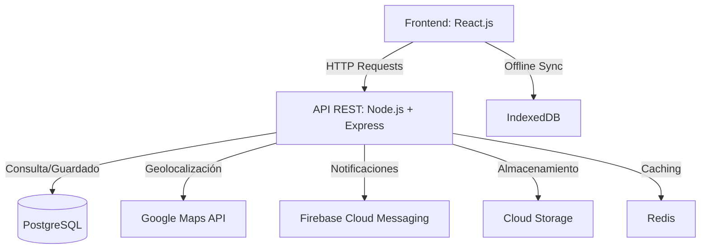

# 🏗️ Sistema de Gestión de Obras de Construcción

[](https://nodejs.org/)
[](https://reactjs.org/)
[](https://www.postgresql.org/)

**Plataforma digital para optimizar la administración de obras, control de asistencia, gestión de materiales y cálculo de pagos.**  
*Desarrollado con ❤️ por [Tu Nombre] para la Universidad Tecnológica de Pereira.*

---

## 🚀 Características Clave

| Módulo                  | Descripción                                                                 | Tecnologías Usadas                     |
|-------------------------|-----------------------------------------------------------------------------|----------------------------------------|
| 👥 **Gestión de Usuarios** | Registro de roles (supervisor, trabajador, administrador) con permisos.     | Node.js, JWT, PostgreSQL, React        |
| 📍 **Control de Asistencia** | Check-in/out con geolocalización y reportes en tiempo real.                 | Google Maps API, Socket.io             |
| 🧱 **Gestión de Materiales** | Solicitud y aprobación de materiales con notificaciones instantáneas.       | Firebase Cloud Messaging, Tailwind CSS |
| 💼 **Cálculo de Pagos**    | Automatización de horas trabajadas y generación de resúmenes descargables.  | PDFKit, Chart.js                       |

---

## 📋 Requerimientos Funcionales (RF)

| **Código** | **Descripción**                                                                 | **Tecnologías Clave**                          | **Prioridad** | **Dificultad** | **Tiempo** |
|------------|---------------------------------------------------------------------------------|------------------------------------------------|---------------|----------------|------------|
| **RF01**   | Gestión de usuarios y roles con autenticación JWT                               | Node.js, PostgreSQL, React, bcrypt.js          | Must Have     | Difícil        | 4 semanas  |
| **RF02**   | Control de asistencia con geolocalización y validación en tiempo real           | Google Maps API, Socket.io, PostgreSQL         | Should Have   | Alta           | 3 semanas  |
| **RF03**   | Administración de materiales y aprobación de solicitudes                        | Node.js, PostgreSQL, WebSockets                | Must Have     | Media          | 2 semanas  |
| **RF04**   | Gestión de zonas de trabajo y asignación de tareas con evidencias fotográficas  | React, Cloud Storage, PostgreSQL               | Must Have     | Media          | 2.5 semanas|
| **RF05**   | Panel de control con métricas y generación de reportes PDF                      | Chart.js, PDFKit, Node.js                      | Should Have   | Media          | 2 semanas  |
| **RF06**   | Chat en tiempo real entre trabajadores y supervisores                           | Socket.io, PostgreSQL, React                   | Could Have    | Media          | 2 semanas  |
| **RF07**   | Funcionamiento offline con sincronización automática                            | IndexedDB, Redis, React                        | Could Have    | Alta           | 3 semanas  |
| **RF08**   | Cálculo automático de pagos basado en asistencia                                 | Node.js, PostgreSQL, PDFKit                    | Must Have     | Alta           | 3 semanas  |
| **RF09**   | Generación de carnets digitales con código de barras                            | React, PDFKit, PostgreSQL                      | Should Have   | Media          | 1 semana   |

---

## 🛡️ Requerimientos No Funcionales (RNF)

| **Código** | **Descripción**                                                                 | **Prioridad** | **Dificultad** | **Tiempo** |
|------------|---------------------------------------------------------------------------------|---------------|----------------|------------|
| **RNF01**  | Rendimiento óptimo (<500ms respuesta) y soporte para alta concurrencia          | Must Have     | Fácil          | 2 semanas  |
| **RNF02**  | Seguridad en autenticación y protección de datos sensibles                      | Must Have     | Alta           | 3 semanas  |
| **RNF03**  | Escalabilidad para crecimiento de usuarios y obras                              | Should Have   | Fácil          | 1 semana   |
| **RNF04**  | Interfaz intuitiva y multi-dispositivo                                          | Won't Have    | Media          | 2 semanas  |
| **RNF05**  | Código documentado y mantenible                                                 | Should Have   | Media          | 2 semanas  |
| **RNF06**  | Integración con Google Maps y notificaciones en tiempo real                     | Could Have    | Alta           | 3 semanas  |


## 📌 Seguimiento del Proyecto

[](https://github.com/orgs/Team-Pepe/projects/5/views/1)

[📊 Tablero completo de actividades](https://github.com/orgs/Team-Pepe/projects/5/views/1)

---

## 🛠️ Tecnologías

**Frontend**:  


**Backend**:  


**Base de Datos**:  


**Integraciones**:  


---

## 📊 Arquitectura del Sistema


## 🗃️ Diagrama Entidad-Relación (PostgreSQL)

```mermaid
erDiagram
    User ||--o{ Role : "tiene"
    User ||--o{ Attendance : "registra"
    User ||--o{ Request : "realiza"
    User ||--o{ Task : "asignado"
    User ||--o{ WorkZone : "supervisa"
    User ||--o{ Message : "envía"
    User ||--o{ Message : "recibe"
    Request }o--|| Material : "solicita"
    WorkZone ||--o{ Task : "contiene"
    WorkZone ||--o{ Metric : "genera"

    User {
        int id PK
        string email
        string username
        string password
    }

    Role {
        int id PK
        string roleName
        string permissions
    }

    Attendance {
        int id PK
        date checkIn
        date checkOut
        float latitud
        float longitud
    }

    Request {
        int id PK
        date requestDate
        string status
    }

    Material {
        int id PK
        string name
        string description
        int quantity
        string image_url
    }

    Task {
        int id PK
        string description
        string status
        date completionDate
        string evidenceUrl
    }

    WorkZone {
        int id PK
        string name
        string description
        float latitud
        float longitud
    }

    Metric {
        int id PK
        string metricType
        float value
        date recordedAt
    }

    Message {
        int id PK
        string message
        date sentAt
    }
