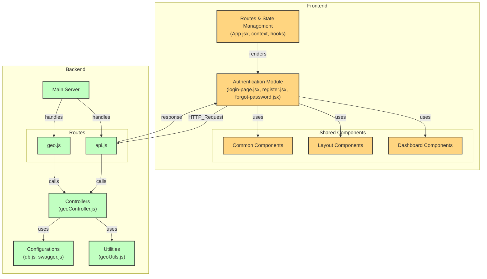

# 🏗️ Sistema de Gestión de Obras de Construcción


**Plataforma digital para optimizar la administración de obras, control de asistencia, gestión de materiales y cálculo de pagos.**  
*Desarrollado por estudiantes de la Universidad Tecnológica de Pereira para la materia TS683 Administracion Y Planeacion De Proyectos Software Gr. 401.*

---

## 🚀 Características Clave

| Módulo                  | Descripción                                                                 | Tecnologías Usadas                     |
|-------------------------|-----------------------------------------------------------------------------|----------------------------------------|
| 👥 **Gestión de Usuarios** | Registro de roles (supervisor, trabajador, administrador) con permisos.     | Node.js, JWT, PostgreSQL, React, bcrypt, prisma       |
| 📍 **Control de Asistencia** | Check-in/out con geolocalización y reportes en tiempo real.                 | Leaflet, React-Leaflet, Turf.js             |
| 🧱 **Gestión de Materiales** | Solicitud y aprobación de materiales con notificaciones instantáneas.       | Radix UI, Tailwind CSS |
| 💼 **Cálculo de Pagos**    | Automatización de horas trabajadas y generación de resúmenes descargables.  | PDFKit, Chart.js, Recharts, date-fns          |

---

## 📋 Requerimientos Funcionales (RF)

| **Código** | **Descripción**                                                                 | **Prioridad** | **Tiempo** |
|------------|---------------------------------------------------------------------------------|---------------|------------|
| **RF01**   | Gestión de usuarios y roles con autenticación JWT                               | Must Have     | 4 semanas  |
| **RF02**   | Control de asistencia con geolocalización y validación en tiempo real           | Should Have   | 3 semanas  |
| **RF03**   | Administración de materiales y aprobación de solicitudes                        | Must Have     | 2 semanas  |
| **RF04**   | Gestión de zonas de trabajo y asignación de tareas con evidencias fotográficas  | Must Have     | 2.5 semanas|
| **RF05**   | Panel de control con métricas y generación de reportes PDF                      | Should Have   | 2 semanas  |
| **RF06**   | Chat en tiempo real entre trabajadores y supervisores                           | Could Have    | 2 semanas  |
| **RF07**   | Funcionamiento offline con sincronización automática                            | Could Have    | 3 semanas  |
| **RF08**   | Cálculo automático de pagos basado en asistencia                                | Must Have     | 3 semanas  |
| **RF09**   | Generación de carnets digitales con código de barras                            | Should Have   | 1 semana   |

---

## 🛡️ Requerimientos No Funcionales (RNF)

| **Código** | **Descripción**                                                                 | **Prioridad** | **Dificultad** | **Tiempo** |
|------------|---------------------------------------------------------------------------------|---------------|----------------|------------|
| **RNF01**  | Rendimiento óptimo (<500ms respuesta) y soporte para alta concurrencia          | Must Have     | Fácil          | 2 semanas  |
| **RNF02**  | Seguridad en autenticación y protección de datos sensibles                      | Must Have     | Alta           | 3 semanas  |
| **RNF03**  | Escalabilidad para crecimiento de usuarios y obras                              | Should Have   | Fácil          | 1 semana   |
| **RNF04**  | Interfaz intuitiva y multi-dispositivo                                          | Won't Have    | Media          | 2 semanas  |
| **RNF05**  | Código documentado y mantenible                                                 | Should Have   | Media          | 2 semanas  |
| **RNF06**  | Integración con Google Maps y notificaciones en tiempo real                     | Could Have    | Alta           | 3 semanas  |


## 📌 Seguimiento del Proyecto

[](https://github.com/orgs/Team-Pepe/projects/5/views/1)

[📊 Tablero completo de actividades](https://github.com/orgs/Team-Pepe/projects/5/views/1)

---

## 🛠️ Tecnologías

| Frontend | Backend | Base de Datos | Utilidades |
|----------|---------|---------------|------------|
|  |  |  |   |
|   |   ||   |
|   |  |
|   | |

### Extracto de package.json
```json
// Frontend
{
  "react": "^18.3.1",
  "react-dom": "^18.3.1",
  "vite": "^6.2.0",
  "tailwindcss": "^3.3.5",
  "@radix-ui/react-dropdown-menu": "^2.1.6",
  "leaflet": "^1.9.4",
  "recharts": "^2.15.1"
}

// Backend
{
  "express": "^4.18.2",
  "@prisma/client": "^5.10.2",
  "prisma": "^5.10.2"
}
```

---

## 📊 Arquitectura del Sistema


## 🗃️ Diagrama Entidad-Relación (PostgreSQL)

```mermaid
erDiagram
    User ||--o{ Message : "enviados como sender"
    User ||--o{ Message : "recibidos como receiver"
    User ||--o{ Request : "solicita"
    User ||--o{ Task : "asignado a"
    User ||--o{ WorkZone : "supervisa"
    Role ||--o{ User : "asignado a"
    
    WorkZone ||--o{ Task : "contiene"
    WorkZone ||--o{ Metric : "medido en"
    
    Material ||--o{ Request : "solicitado"
    
    User {
        int id PK
        string email
        string username
        int roleId FK
        string password
    }
    
    WorkZone {
        int id PK
        string name
        string description
        int supervisorId FK
        float latitud
        float longitud
    }
    
    Task {
        int id PK
        int workZoneId FK
        int assignedTo FK
        string description
        string status
        datetime completionDate
        string evidenceUrl
    }
    
    Material {
        int id PK
        string name
        string description
        int quantity
        string image_url
    }
    
    Request {
        int id PK
        int userId FK
        int materialId FK
        datetime requestDate
        string status
    }
    
    Attendance {
        int id PK
        int userId FK
        datetime checkIn
        datetime checkOut
        float latitud
        float longitud
    }
    
    Message {
        int id PK
        int senderId FK
        int receiverId FK
        string message
        datetime sentAt
    }
    
    Metric {
        int id PK
        int workZoneId FK
        string metricType
        float value
        datetime recordedAt
    }
    
    Role {
        int id PK
        string roleName
        string permissions
    }
